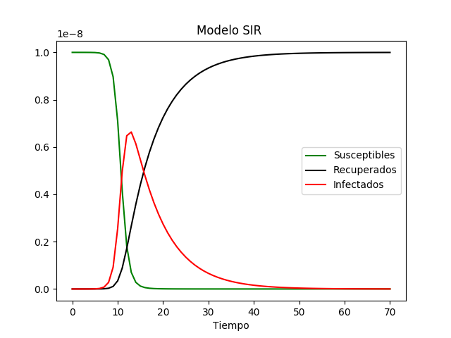

# modelo_sir_coronavirus
Un modelo SIR basico sobre el coronavirus

Por los acontecimientos recientes decidi investigar un poco un modelo sobre propagación del coronavirus. 

## Se planea crear mas modelos hasta llegar a modelos Deep Learning

## **modelo sir**

les dejo  unas fuentes donde me pude asesorar mejor

[1°Modelo SIR](https://en.wikipedia.org/wiki/Compartmental_models_in_epidemiology#The_SIR_model)

[2°Modelado matemático de enfermedades infecciosas](https://en.wikipedia.org/wiki/Mathematical_modelling_of_infectious_disease)

[Los patrones de movilidad humana predicen dinámicas epidémicas divergentes entre ciudades.](https://www.ncbi.nlm.nih.gov/pubmed/23864593)

*f04a5402f41119f79b4f9526972845f8*
